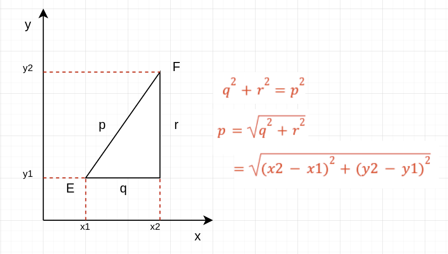

# 📚 Python Uygulama 2

## Minimum Öklid Mesafesinin Hesaplanması



### Resimdeki formül:

```math
d = √(x₂-x₁)²+(y₂-y₁)²
```

Öklid mesafesi, Öklid uzayındaki iki nokta arasındaki "sıradan" düz çizgi mesafesidir. Bu formül ile, düzlemde veya üç boyutlu uzayda iki nokta arasındaki mesafeyi bulabilirsiniz.

### Göreviniz:

Python'da fonksiyonlar ve döngüler kavramlarını kullanarak, aşağıdaki işlemleri gerçekleştiren bir program yazmanız gerekmektedir:

### Noktaların Tanımlanması:

‘points’ adında bir liste oluşturun. Bu liste, 2D uzaydaki noktaları temsil eden demetler (tuple) içermelidir. Örneğin, ‘(x, y)’ noktası bir demet ‘(x, y)’ olarak temsil edilecektir.

### Öklid Mesafesi İçin Bir Fonksiyon Yazma:

‘euclideanDistance’ adında bir fonksiyon tanımlayın. Bu fonksiyon, iki demet (her biri bir noktayı temsil eder) almalı ve bu iki nokta arasındaki Öklid mesafesini döndürmelidir.

### Mesafelerin Hesaplanması:

Bir döngü kullanarak, ‘points’ listesindeki her nokta çifti arasındaki Öklid mesafesini hesaplayın. Bu mesafeleri ‘distances’ adında başka bir listede saklayın.

### Minimum Mesafenin Bulunması:

‘distances’ listesinden minimum mesafeyi bulun ve yazdırın.

_Not: Eğer daha zorlayıcı bir görevlendirme istiyorsanız herhangi bir kütüphane ve modül kullanmadan da yapabilrsiniz._